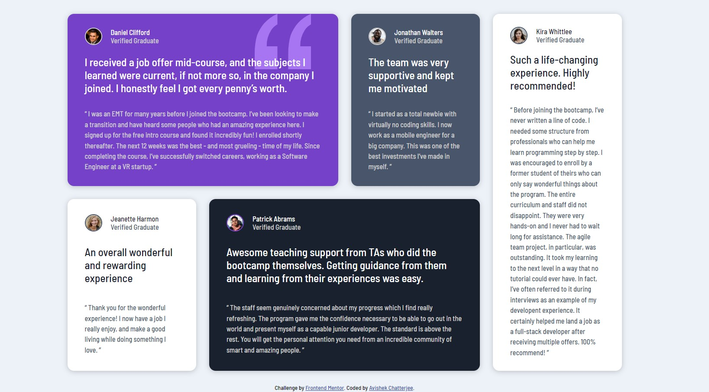
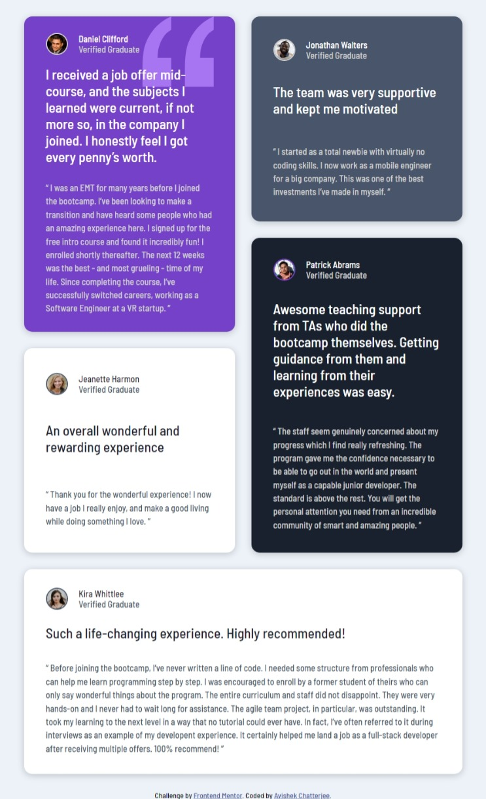

# Frontend Mentor - Testimonials grid section solution

This is a solution to the [Testimonials grid section challenge on Frontend Mentor](https://www.frontendmentor.io/challenges/testimonials-grid-section-Nnw6J7Un7). Frontend Mentor challenges help you improve your coding skills by building realistic projects. 

## Table of contents

- [Overview](#overview)
  - [The challenge](#the-challenge)
  - [Screenshot](#screenshot)
  - [Built with](#built-with)
 
**Note: Delete this note and update the table of contents based on what sections you keep.**

## Overview
Hi, I'm Avishek Chatterjee, I am a final year engineering student from Jadavpur University, Kolkata. Currently I am practising and learning full-stack web development.
### The challenge

Users should be able to:

- View the optimal layout for the site depending on their device's screen size

### Screenshot

### Built with

- Semantic HTML5 markup
- CSS custom properties
- Flexbox
- CSS Grid
- Mobile-first workflow

**Note: These are just examples. Delete this note and replace the list above with your own choices**

